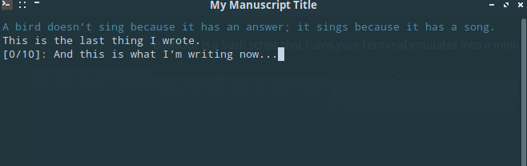

# BashOut CLI Version

The CLI (terminal) version of BashOut provides a clean, forward-only writing environment for your terminal, helping you focus on new words and avoid distractions.

## Features

- Clean, distraction-free terminal interface
- Inspirational banners, notes, and style prompts
- Word count tracking (session and total)
- Last sentence display
- Forward-only writing (no editing previous work)
- Automatic saving to a text file

### Screenshot



## Requirements

- Bash (Unix-like terminal: macOS, Linux)

## Installation and Setup

1. Make the scripts executable:

```bash
chmod +x bashout.sh
```

## Usage

The script can be started in two ways: **interactive mode** and **automatic mode**.

### Interactive Mode

The interactive mode will prompt you to choose a banner style.

1. Run the script:

```bash
./bashout.sh
```

You will be presented with a menu to choose a banner style:
- **1 - Inspirational quote:** Displays a random quote from `resources/quotes.txt`.
- **2 - Note:** Prompts you to enter a note, which is then displayed as the banner.
- **3 - Style prompt:** Generates a random writing style prompt.

> **Note:**
> If you enter an invalid menu option, the writing interface will still launch but the banner will show:
> ```bash
> No banner available.
> ```

### Automatic Mode

Automatic mode takes the banner choice as an argument from the invocation command, bypassing the menu.

```bash
./bashout.sh <N>
```

Where `<N>` is the number of the banner style you want as listed above.

> **Note:**
> If you pass an invalid argument, the writing interface will still launch but the banner will show:
> ```bash
> No banner available.
> ```

## Writing Interface

- Clears the screen
- Displays the chosen banner
- Displays the last sentence you wrote (if any)
- Shows your session and total word counts
- Prompts you for a new sentence

## Writing Text

- Type your text as you normally would
- When you finish a line or paragraph, press `[Enter]`:
  - Clears your text from the interface
  - Saves it to a local file (`~/Documents/output.txt`)
  - Updates the last sentence display
  - Increments the word counts
- To exit, press `Ctrl+C` (be sure to hit `[Enter]` first to save your latest input)

## Customization

- **Banner Color:** Change the banner text color by modifying the `printf` command in `bashout.sh`.
- **Custom Banners:** Add more banner options by creating new text files in the `resources` directory and updating the `case` statement in `bashout.sh`.
- **Style Prompts:** Edit the lists in the style prompt section of `bashout.sh` to customize the generated prompts.
- **Saving Location:** Change the `SAVE_FILE` variable in `bashout.sh` to save your writing to a different location.
- **Resetting Word Count:** To reset the total word count, delete or move `output.txt`. The script will create a new file on next run. The session word count always starts at zero.
- **.gitignore:** By default, the `resources/` directory (except for `quotes.txt`) is ignored by Git. 