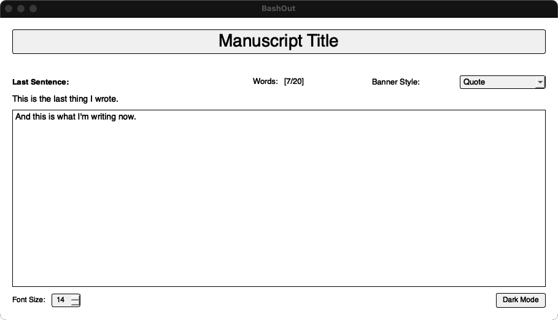
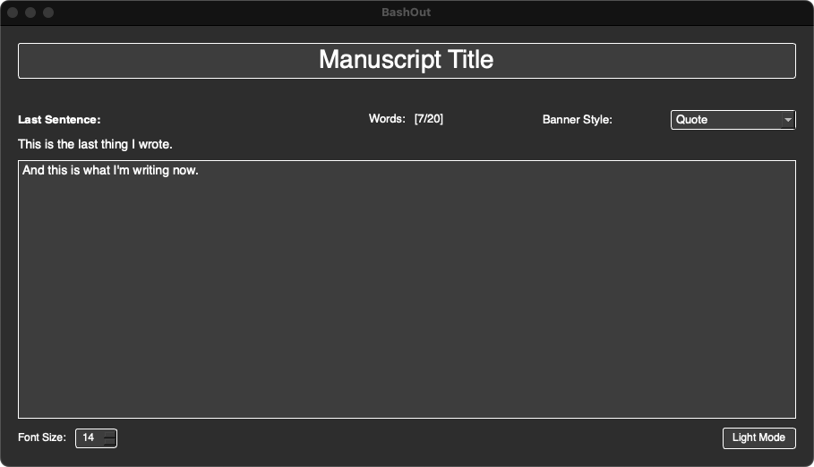

# BashOut GUI Version

The GUI version of BashOut provides the same core functionality as the terminal version but with a modern desktop interface that works identically across all major platforms.

## Features

- Clean, distraction-free writing environment
- Manuscript management (create, rename, switch between)
- Word count tracking
- Last sentence display
- Light/dark theme support
- Font size adjustment
- Automatic saving

### Screenshots

**Light Mode:**



**Dark Mode:**



## Requirements

- Python 3.x (available on all major platforms)
- PyQt5 (cross-platform GUI framework)

## Installation

1. Install the required Python package:

```bash
pip install PyQt5
```

2. Run the GUI version:

```bash
python3 bashout_gui.py
```

## Usage

### Manuscript Management

- Create new manuscripts (⌘+N on Mac, Ctrl+N on Windows/Linux)
- Rename manuscripts (⌘+R on Mac, Ctrl+R on Windows/Linux)
- Click the manuscript name to manage

### Writing Interface

- Large, centered text input
- Word count display
- Last sentence preview
- Automatic saving

### Customization

- Toggle between light and dark themes
- Adjust font size
- Choose save location

## Configuration and Customization

- **Saving Location:** Choose or change where your manuscripts are saved from within the app.
- **Theme:** Switch between light and dark mode.
- **Font Size:** Adjust the writing font size to your preference. 